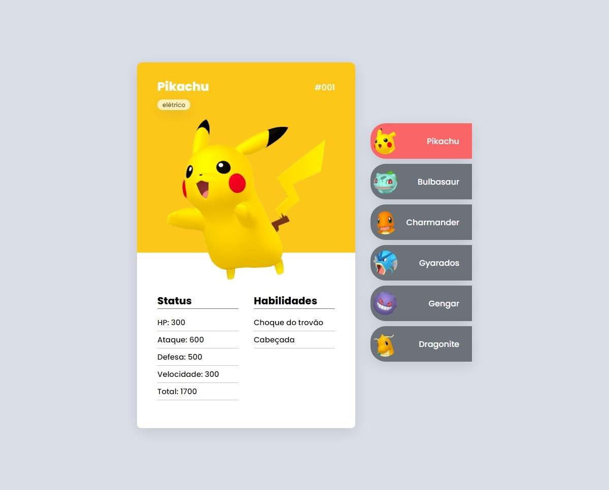
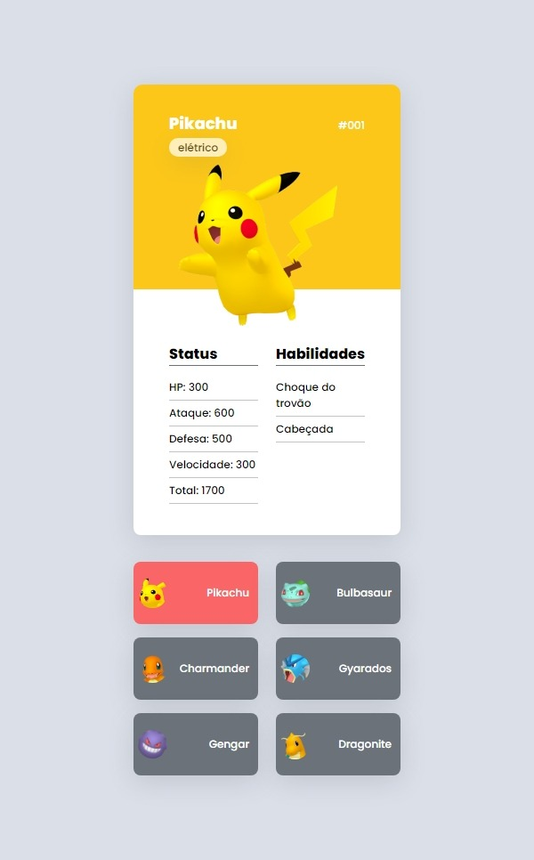

# Projeto Pokedex

- Projeto criado na Semana do Zero ao Programador Contratado com os gêmeos do Dev em Dobro.

## ScreenShots

- Screnshot do site versão desktop

    

- Screnshot do site versão mobile

    

## Tecnologias utilizadas

  

## Link

- Live Site: <a href="https://teoniuvilarinho.github.io/projeto-pokedex" target="_blank">www.projeto-pokedex.com</a>
